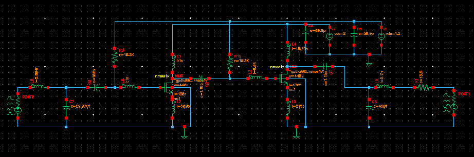
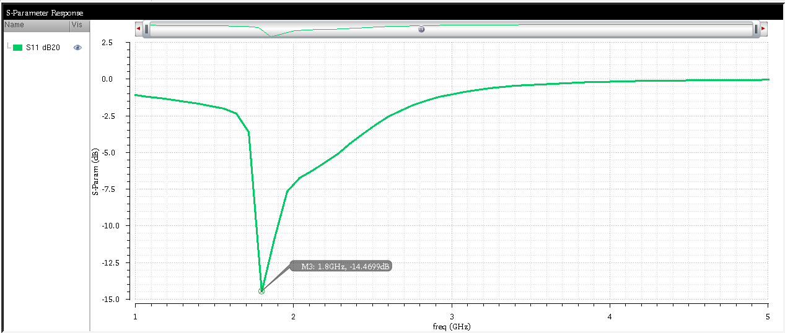
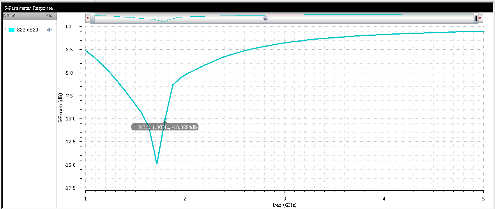
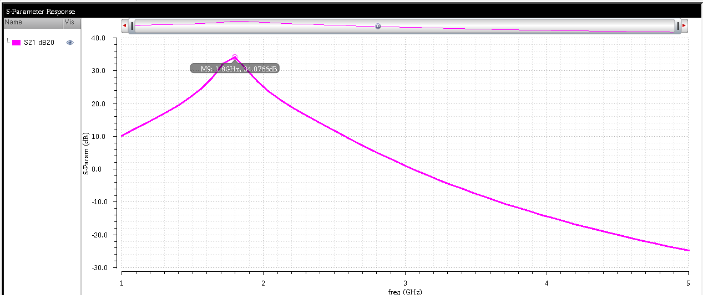
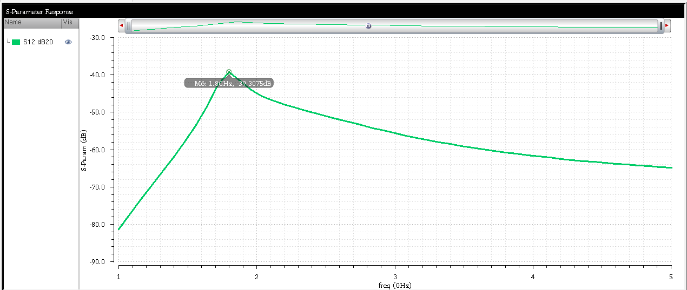
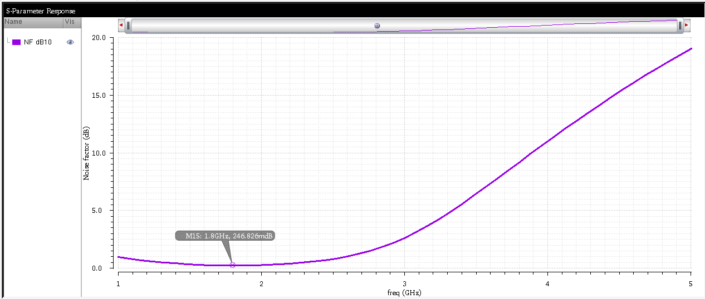
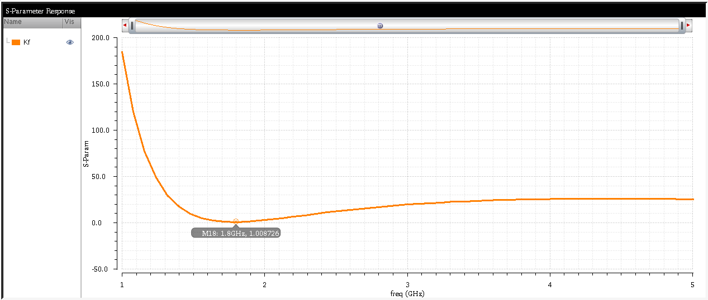

# Low-Noise RF Amplifier for Wireless Communication

**Technology:** GPDK090 (90 nm CMOS)  
**Tools:** Cadence Virtuoso  

## Project Overview
This project presents the design and simulation of a high-performance Low-Noise Amplifier (LNA) optimized for operation at 1.8 GHz. The primary objective is to achieve a combination of high gain, low noise figure, and excellent input-output matching while ensuring unconditional stability. The proposed LNA is implemented using GPDK090 CMOS technology, offering a cost-effective and compact solution for RF front-end applications.

## Design Specifications
The LNA was designed to meet the following target parameters for modern RF receiver front-ends:
*   **Operating Frequency:** 1.8 GHz
*   **Gain (S21):** > 13 dB
*   **Noise Figure (NF):** <= 1 dB
*   **Input Return Loss (S11):** <= -13 dB
*   **Stability Factor (K):** > 1

## Architecture & Methodology

The design utilizes a two-stage CMOS Low-Noise Amplifier topology. 
*   **Input Matching & Noise:** Uses inductive source degeneration for input matching and to maintain a low noise figure (NF). 
*   **Matching Networks:** An online RF Impedance Matching calculator was utilized to determine the initial values for the inductors and capacitors in the input and output matching networks. 
*   **Inter-stage Design:** Features RF choke inductors and an AC coupling capacitor between the first and second amplifying stages.

## Simulation Results
Extensive parametric sweeps and simulations were conducted in Cadence Virtuoso. The final design successfully met and exceeded all target specifications at 1.8 GHz:

*   **Input Reflection Coefficient (S11):** Achieved **-14.4699 dB**, indicating strong input matching and reduced signal loss.
     
    

*   **Output Reflection Coefficient (S22):** Achieved **-10.0554 dB**, ensuring efficient signal transfer to the next stage.
     
    

*   **Forward Transmission Coefficient (S21):** Achieved a high gain of **34.0766 dB**.
     
    

*   **Reverse Transmission (S12):** Achieved **-39.3075 dB**, indicating excellent reverse isolation.
     
    

*   **Noise Figure (NF):** Achieved **0.246826 dB**, well below the 1 dB target, ensuring minimal added noise.
     
    

*   **Stability Factor (K):** Achieved **1.008726**, ensuring the amplifier is unconditionally stable across the operating frequency range.
     
    

## Future Work
*   **Physical Layout:** Completing the physical layout design using Cadence Virtuoso and performing post-layout simulations with DRC and LVS verifications.
*   **Power Optimization:** Refining the biasing networks to reduce overall power consumption for battery-powered applications.
*   **Technology Scaling:** Adapting the design approach to smaller process nodes, such as 65 nm CMOS, for higher integration and improved frequency response.
